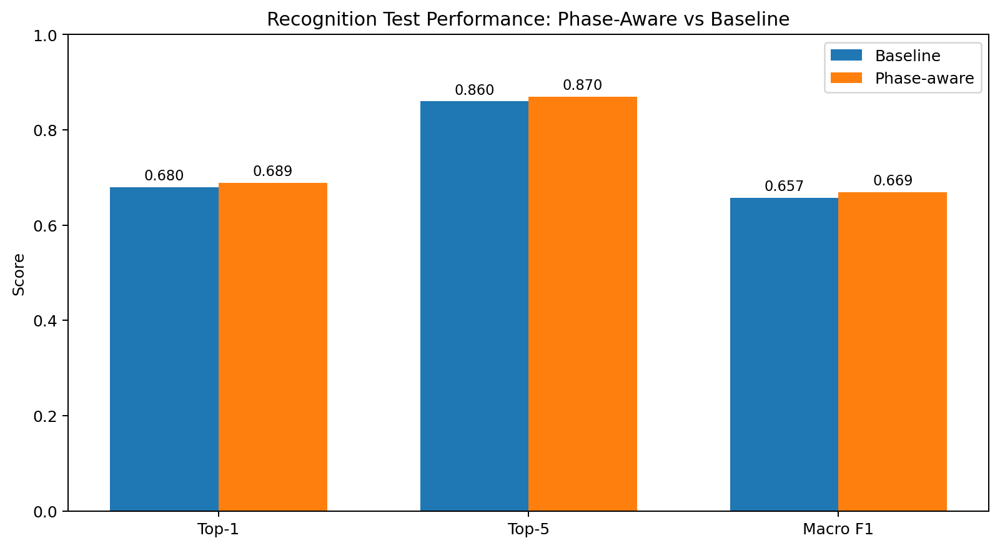
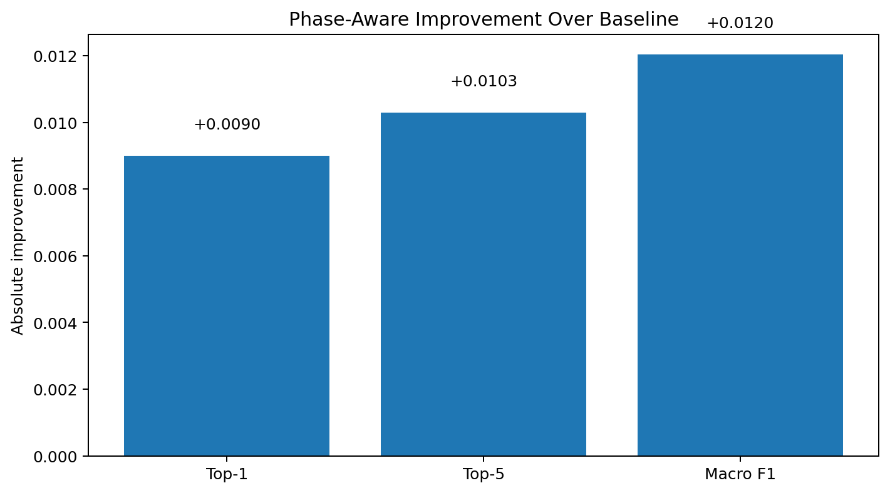
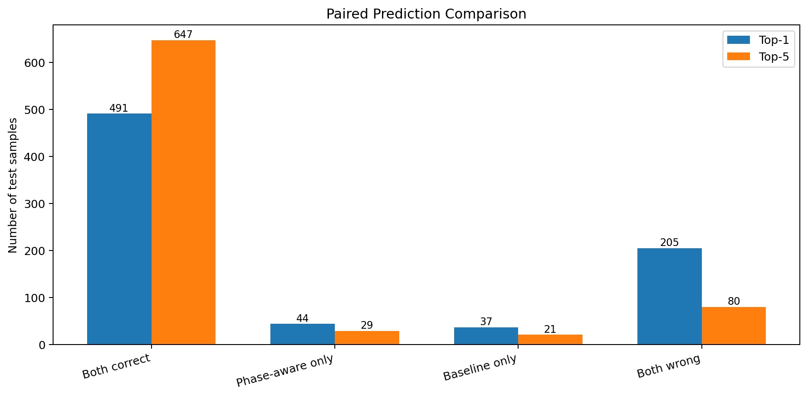
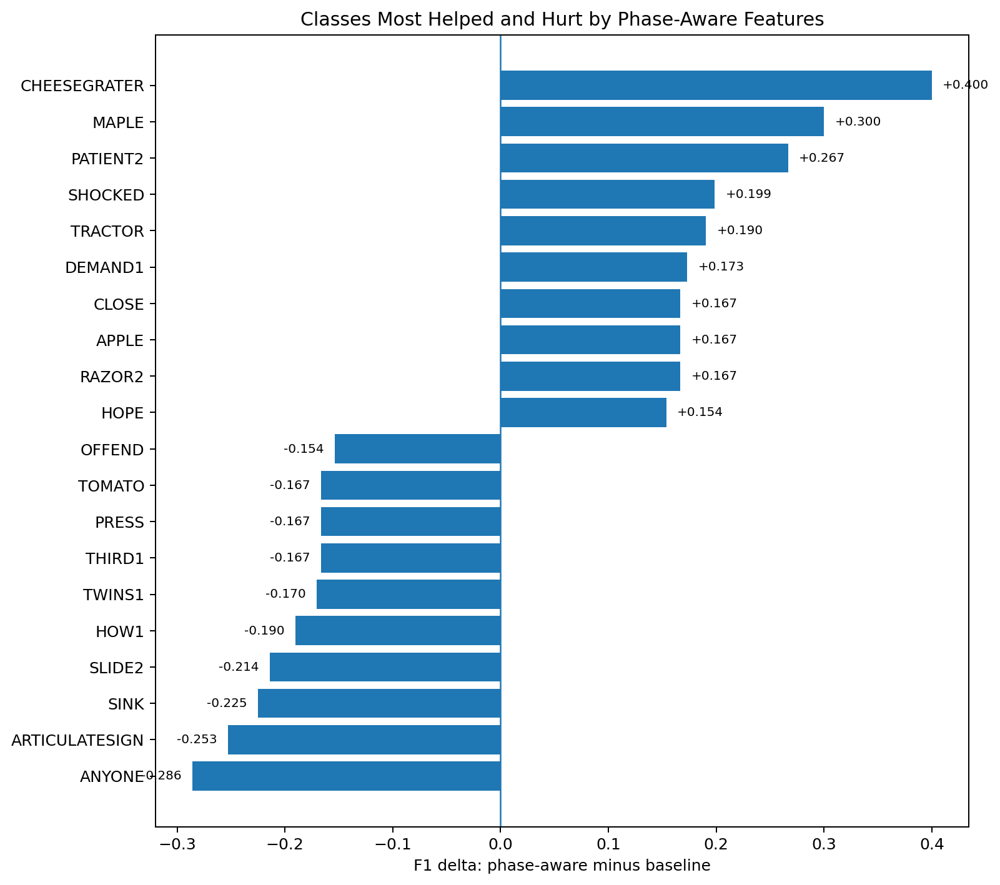
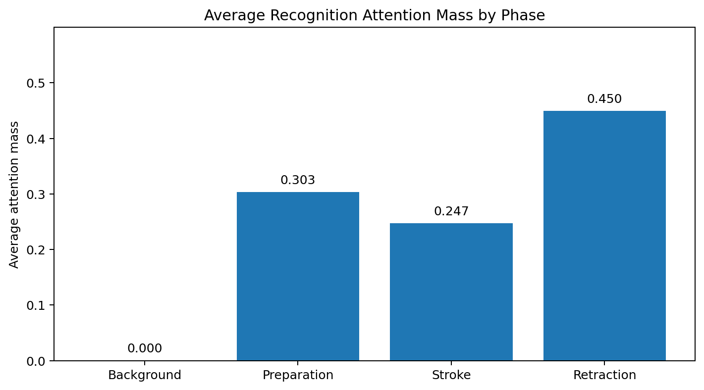
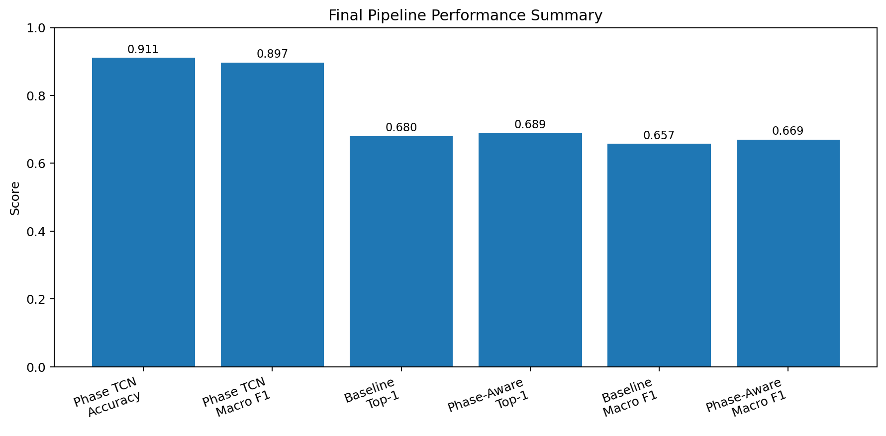

# Keypoint-Centric Sign Language Recognition

> **Capstone Project**  

---

A two-part research project on **sign language recognition (SLR)**, unified by a
keypoint-centric methodology and a controlled-comparison experimental discipline:

| Part | Setting | Benchmark | Core contribution |
|---|---|---|---|
| **I** | Isolated sign classification | ASL Citizen, 100 classes | Phase-aware TCN with weak pseudo-labels |
| **II** | Continuous sign transcription | PHOENIX-2014-T (DGS) | BiLSTM-CTC over ResNet-18 frame features |

**Central finding.** Skeleton keypoints carry a dominant signal in both settings.
Structural augmentations — phase one-hot features in Part I, active-region
segmentation in Part II — yield consistent but modest gains that are honestly
characterized and not over-claimed.

---

## Table of Contents

1. [Results at a glance](#results-at-a-glance)
2. [Part I — Phase-Aware Isolated ASL Recognition](#part-i--phase-aware-isolated-asl-recognition)
3. [Part II — Continuous Sign Language Recognition](#part-ii--continuous-sign-language-recognition)
4. [Repository structure](#repository-structure)
5. [Installation](#installation)
6. [Datasets](#datasets)
7. [Reproducing the results](#reproducing-the-results)
8. [Real-time demo](#real-time-demo)
9. [Report and figures](#report-and-figures)
10. [Limitations and future work](#limitations-and-future-work)
11. [References](#references)
12. [License](#license)

---

## Results at a glance

### Part I — Isolated ASL (ASL Citizen · top-100 classes · 777 test clips)

| Model | Test Top-1 | Test Top-5 | Test Macro F1 |
|---|:---:|:---:|:---:|
| Baseline (no phase features) | 67.95 % | 85.97 % | 0.6574 |
| **Phase-aware (+ phase one-hot)** | **68.85 %** | **87.00 %** | **0.6695** |
| Δ | +0.90 % | +1.03 % | +0.0120 |

Phase Detection TCN: **91.1 % frame accuracy · 89.7 % macro-F1** (1,020 test sequences, 81,953 frames).  
Paired McNemar test: **p ≈ 0.50** — the gain is consistent in direction across all three metrics
but not statistically significant at this sample size. It is reported as a promising signal,
not a performance breakthrough.

### Part II — Continuous SLR (PHOENIX-2014-T · German Sign Language)

| Model | Dev WER | Test WER |
|---|:---:|:---:|
| BiLSTM-CTC (ResNet-18 features, greedy decode) | 72.12 % | **70.12 %** |

WER = Word Error Rate (lower is better). A WER of 70 % implies roughly 30 % of glosses are
predicted correctly on average. This is a feasibility-grade baseline; no beam search or
language model is applied.

---

## Part I — Phase-Aware Isolated ASL Recognition

Sign language phonology (Liddell & Johnson 1989; Brentari 1998) identifies three temporal
phases within each sign: **preparation**, **stroke** (the expressive nucleus), and
**retraction**. This project asks whether making those phases explicit improves a keypoint-based
recognizer.

### Pipeline

```
ASL Citizen clip
    │
    ▼
MediaPipe pose + both hands
    49 landmarks → 147-d positions / frame
    │
    ▼
Normalization + temporal derivatives
    position · velocity · acceleration
    global speed · hand speed · phase speed
    ─────────────────────────────────────
    444-d motion feature vector / frame
    │
    ▼
Phase Detection TCN  ──────────────────────────────────────────────┐
    trained on velocity-derived weak pseudo-labels                 │
    (background / preparation / stroke / retraction)               │
    91.1 % accuracy · 89.7 % macro-F1                             │
    │                                                              │
    ▼                                                              │
Active-region extraction                                           │
    + 4 ordered phase one-hot features  ◄──────────────────────────┘
    ─────────────────────────────────────
    448-d input / frame  (baseline: 444-d, no one-hots)
    │
    ▼
Recognition TCN + Attention Pooling
    │
    ▼
Softmax over 100 ASL classes
```

### Key design choices

- **Weak pseudo-labels, not human annotation.** Phase boundaries are derived from
  motion-peak heuristics on velocity curves. The 91.1 % phase accuracy measures
  agreement with the heuristic, not linguistic ground truth.
- **Single-variable ablation.** The baseline and phase-aware models share the same
  architecture, active-region crop, continuous features, train/val/test split, and
  optimizer. The only difference is the 4 phase one-hot dimensions.
- **Quality filter.** Segments flagged as overly broad, oscillatory, or low-agreement
  were excluded from recognition training. This biases the dataset toward signs with
  clean single-motion structure (e.g., TWINS, COMB, PIPE had high drop rates).

---

## Part II — Continuous Sign Language Recognition

The CSLR system transcribes an unsegmented sequence of sign video frames into a
gloss sequence using a BiLSTM encoder trained with CTC loss on the
PHOENIX-2014-T benchmark (DGS weather-broadcast footage).

### Architecture

```
Input: folder of PNG frames (sorted lexicographically)
    │
    ▼  stride = 2 (every other frame)
ResNet-18 (pretrained, fc → Identity)
    224×224 crop · ImageNet normalization
    → 512-d feature vector / kept frame
    │
    ▼
BiLSTM encoder  (2 layers × 512 hidden units)
    → per-frame log-probabilities over 1,088 tokens
    │
    ▼
Greedy CTC decode
    (argmax → collapse repeats → remove blanks)
    │
    ▼
Gloss sequence  (e.g.  MORGEN REGEN NORD SUED)
```

The system ships with three sample PHOENIX-2014-T video clips and ground-truth
labels so results can be reproduced offline without downloading the full dataset.
See [`sign_language_demo/`](sign_language_demo/) for the self-contained demo.

---

## Repository structure

```
CAPSTONE_ASL/
│
├── notebooks/
│   ├── Feature.ipynb                    ← MediaPipe keypoint extraction (Tasks API)
│   └── Un.ipynb                         ← Full Part I training pipeline (90 cells)
│
├── weights/
│   ├── phase_tcn_best_safe_state.pt     ← Trained Phase Detection TCN
│   └── recognition_tcn_attention_best.pt← Trained Recognition TCN + Attention
│
├── assets/
│   ├── hand_landmarker.task             ← MediaPipe hand landmark model (~8 MB)
│   └── pose_landmarker_full.task        ← MediaPipe pose landmark model (~9 MB)
│
├── data/
│   └── recognition_label_map_with_split_counts.csv
│
├── realtime_demo/
│   ├── demo.py                          ← Webcam record-one-sign demo
│   ├── pipeline.py                      ← Shared inference pipeline module
│   └── verify_pipeline.py              ← Offline checkpoint verification
│
├── sign_language_demo/                  ← Part II — CSLR demo (PHOENIX-2014-T)
│   ├── src/
│   │   ├── model.py                     ← BiLSTMCTC_V2 architecture
│   │   ├── feature_extractor.py         ← ResNet-18 → 512-d features
│   │   ├── decoder.py                   ← Greedy CTC decoder
│   │   └── inference.py                 ← SignLanguageRecognizer API
│   ├── demos/
│   │   ├── demo_phoenix_video.py        ← Single-video CLI demo
│   │   └── demo_all_samples.py         ← All-samples summary table
│   ├── weights/
│   │   └── ctc_best_v2.pt              ← Trained CSLR checkpoint (~46 MB)
│   └── sample_videos/                  ← 3 PHOENIX-2014-T clips + ground truth
│
├── reports/
│   ├── figures/
│   │   ├── fig_01_recognition_model_comparison.png
│   │   ├── fig_02_phase_aware_delta.png
│   │   ├── fig_03_paired_prediction_comparison.png
│   │   ├── fig_04_per_class_f1_delta.png
│   │   ├── fig_05_attention_mass_by_phase.png
│   │   └── fig_06_final_pipeline_summary.png
│   ├── report_text/
│   │   ├── 01_abstract.md
│   │   ├── 02_introduction.md
│   │   ├── 03_methodology.md
│   │   ├── 04_experiments_and_results.md
│   │   ├── 05_discussion.md
│   │   ├── 06_limitations_and_future_work.md
│   │   └── 07_conclusion.md
│   ├── final_results_summary.json       ← Machine-readable full results
│   └── final_results_tables.md          ← Markdown result tables
│
└── requirements.txt
```

---

## Installation

Tested on Windows 10/11 and Linux with Python 3.10. A virtual environment is
strongly recommended.

```bash
git clone https://github.com/H29-crypto/CAPSTONE_ASL.git
cd CAPSTONE_ASL

python -m venv .venv
# Windows (PowerShell):
.\.venv\Scripts\Activate.ps1
# Linux / macOS:
source .venv/bin/activate

pip install -r requirements.txt
```

On Windows, if PowerShell blocks script execution:

```powershell
Set-ExecutionPolicy -Scope Process -ExecutionPolicy Bypass
```

**Part II extra dependency** (ResNet-18 feature extraction):

```bash
pip install torchvision
```

---

## Datasets

Neither dataset is redistributed in this repository.

### Part I — ASL Citizen

Community-sourced, signer-independent isolated-ASL dataset (Desai et al.,
NeurIPS 2023). Full release: 83,401 videos · 2,731 classes · 52 signers. This
project uses a **top-100-class subset** selected by training-set frequency.
Reported results are on the post-filter split (1,215 train / 242 val / 777 test)
after phase-segmentation quality filtering.

Download: [Microsoft Download Center](https://download.microsoft.com/download/b/8/8/b88c0bae-e6c1-43e1-8726-98cf5af36ca4/ASL_Citizen.zip)

### Part II — RWTH-PHOENIX-Weather 2014-T

The standard gloss-annotated continuous SLR benchmark (Koller et al., 2015).
German Sign Language weather broadcasts · 7,096 sentences · 1,066 glosses.
Full official splits used (5,672 / 540 / 629).

Download: [RWTH PHOENIX page](https://www-i6.informatik.rwth-aachen.de/~koller/RWTH-PHOENIX-2014-T/)

---

## Reproducing the results

### Part I (isolated, Colab recommended)

1. **Extract keypoints** — open [`notebooks/Feature.ipynb`](notebooks/Feature.ipynb)
   and run all cells. Produces one `.npz` file per clip.
2. **Train the pipeline** — open [`notebooks/Un.ipynb`](notebooks/Un.ipynb):
   - Cells 41–45: motion features + weak phase pseudo-labels
   - Cells 48–51: Phase Detection TCN training and evaluation
   - Cells 52–53: active-region segment extraction
   - Cells 56–62: Recognition TCN training (phase-aware **and** baseline)
3. Results are summarized in [`reports/final_results_summary.json`](reports/final_results_summary.json)
   and [`reports/final_results_tables.md`](reports/final_results_tables.md).

A T4 GPU is sufficient. Total training compute is approximately 4–6 hours.

### Part II (CSLR)

All commands run from `sign_language_demo/`:

```bash
cd sign_language_demo

# Single video with ground truth
python demos/demo_phoenix_video.py \
    --video_folder sample_videos/27November_2009_Friday_tagesschau-7342

# All three sample clips — summary table
python demos/demo_all_samples.py
```

Verify the checkpoint loads correctly:

```python
import torch
ckpt = torch.load('weights/ctc_best_v2.pt', map_location='cpu', weights_only=False)
print('Vocab size:', len(ckpt['gloss2idx']))   # → 1088
print('Dev WER:   ', round(ckpt['dev_wer'] * 100, 2), '%')  # → 72.12 %
```

---

## Real-time demo (Part I)

```bash
python realtime_demo/demo.py
```

On first launch the script downloads the two MediaPipe model files
(`pose_landmarker_full.task` and `hand_landmarker.task`, ~17 MB) into `assets/`.

Controls:

| Key | Action |
|---|---|
| **R** | Record a ~2-second clip and predict the sign |
| **Q** | Quit |

The demo is **record-one-sign**, not a continuous rolling buffer — this matches
the training distribution and gives stable predictions.

To verify the inference pipeline without a webcam:

```bash
python realtime_demo/verify_pipeline.py
```

---

## Report and figures

The written report is split into sections under
[`reports/report_text/`](reports/report_text/):

| Section | File |
|---|---|
| Abstract | [01_abstract.md](reports/report_text/01_abstract.md) |
| Introduction | [02_introduction.md](reports/report_text/02_introduction.md) |
| Methodology | [03_methodology.md](reports/report_text/03_methodology.md) |
| Experiments & Results | [04_experiments_and_results.md](reports/report_text/04_experiments_and_results.md) |
| Discussion | [05_discussion.md](reports/report_text/05_discussion.md) |
| Limitations & Future Work | [06_limitations_and_future_work.md](reports/report_text/06_limitations_and_future_work.md) |
| Conclusion | [07_conclusion.md](reports/report_text/07_conclusion.md) |

### Figure 1 — Recognition model comparison



*Test-set performance of the baseline TCN-attention model versus the phase-aware
TCN-attention model across Top-1 accuracy, Top-5 accuracy, and Macro F1.*

---

### Figure 2 — Phase-aware improvement over baseline



*Absolute test-set improvement of the phase-aware model on all three evaluation
metrics. All deltas are positive; statistical significance is discussed in the text.*

---

### Figure 3 — Paired prediction comparison



*Per-sample paired analysis: both models correct (491), phase-aware only correct
(44), baseline only correct (37), both wrong (205). Net phase-aware Top-1 gain: 7 samples.*

---

### Figure 4 — Per-class F1 delta



*Classes most improved and most hurt by adding ordered phase one-hot features.
Phase modeling is beneficial for signs with clear single-motion structure
(e.g., CHEESEGRATER, MAPLE) and harmful for some oscillatory signs (e.g., ANYONE, SINK).*

---

### Figure 5 — Attention mass by phase



*Average attention weight assigned by the recognition model to frames in each
phase region. The model attends across preparation, stroke, and retraction —
not exclusively to the stroke — suggesting that temporal context around the main
motion contributes to recognition.*

---

### Figure 6 — Final pipeline summary



*Combined summary of the Phase Detection TCN and the final recognition model,
showing inputs, architecture blocks, and evaluation metrics.*

---

## Limitations and future work

### Documented limitations

- **Weak phase labels.** Preparation / stroke / retraction labels are derived from
  velocity-peak heuristics, not human linguistic annotation. The 91.1 % phase
  accuracy measures agreement with the heuristic, not ground-truth phonology.
- **Small per-class sample count.** 1,215 training examples across 100 classes
  creates a difficult learning problem and increases overfitting risk.
- **Phase features are not universally helpful.** The phase-aware model improved
  44 samples that the baseline missed but degraded 37 others. Net gain: 7 out of
  777 test samples (McNemar p ≈ 0.50).
- **Phase-quality filter bias.** Signs with multi-peak or oscillatory motion were
  disproportionately excluded, biasing the dataset toward simpler motion profiles.
- **Part II WER ceiling.** The CSLR model uses generic ResNet-18 features and
  greedy decoding with no language model — a feasibility baseline, not a
  competitive system.

### Future work

- Stride-2 video re-extraction and per-stream auxiliary CTC supervision for the
  CSLR model; gated-fusion and Transformer-head ablations.
- Bind the official PHOENIX sclite evaluator to certify WER against published
  checkpoints.
- Beam search + a gloss n-gram language model.
- Human-annotated or semi-automatic phase correction for linguistically grounded
  labels.
- Larger per-class support and signer-independent splits for an adequately-powered
  significance test.
- YOLO-assisted signer localization before MediaPipe for cluttered scenes.
- Inject phase posteriors from Part I into the Part II continuous stream.

---

## References

| Work | Citation |
|---|---|
| ASL Citizen | Desai et al., *ASL Citizen: A Community-Sourced Dataset for Advancing Isolated Sign Language Recognition*, NeurIPS 2023 |
| PHOENIX-2014-T | Koller et al., *Continuous sign language recognition: Towards large vocabulary statistical recognition systems handling multiple signers*, CVIU 2015 |
| MediaPipe | Lugaresi et al., 2019 |
| TCN / ED-TCN | Bai et al. 2018; Lea et al., CVPR 2017 |
| SAM-SLR (keypoint-subset) | Jiang et al., CVPRW 2021 |
| ResNet | He et al., CVPR 2016 |
| CTC | Graves et al., ICML 2006 |
| Sign phonology | Liddell & Johnson, *Sign Language Studies* 64, 1989; Brentari 1998 |

If you reference this project:

```bibtex
@misc{capstone_slr_2026,
  title  = {Keypoint-Centric Sign Language Recognition:
            Phase-Aware Isolated ASL and Continuous SLR},
  author = {Alakkad, Hamdi and Bak{\i}\c{s}, Metin Ya\u{g}{\i}z
            and Hadri, Yaser and Sokhangoo, Aria},
  year   = {2026},
  note   = {Capstone Project, Department of Artificial Intelligence Engineering,
            Bah\c{c}e\c{s}ehir University}
}
```

This work uses only open-source software and publicly released, research-licensed
datasets and checkpoints. No new human-subject data were collected.
Gloss recognition is **not** translation — outputs are gloss sequences, and the
system is designed to support, not replace, human interpreters.

---

## License

MIT — see [LICENSE](LICENSE).

Dataset and third-party checkpoint licenses are independent of this repository's
license; users must obtain them from the original sources under their respective
terms.
